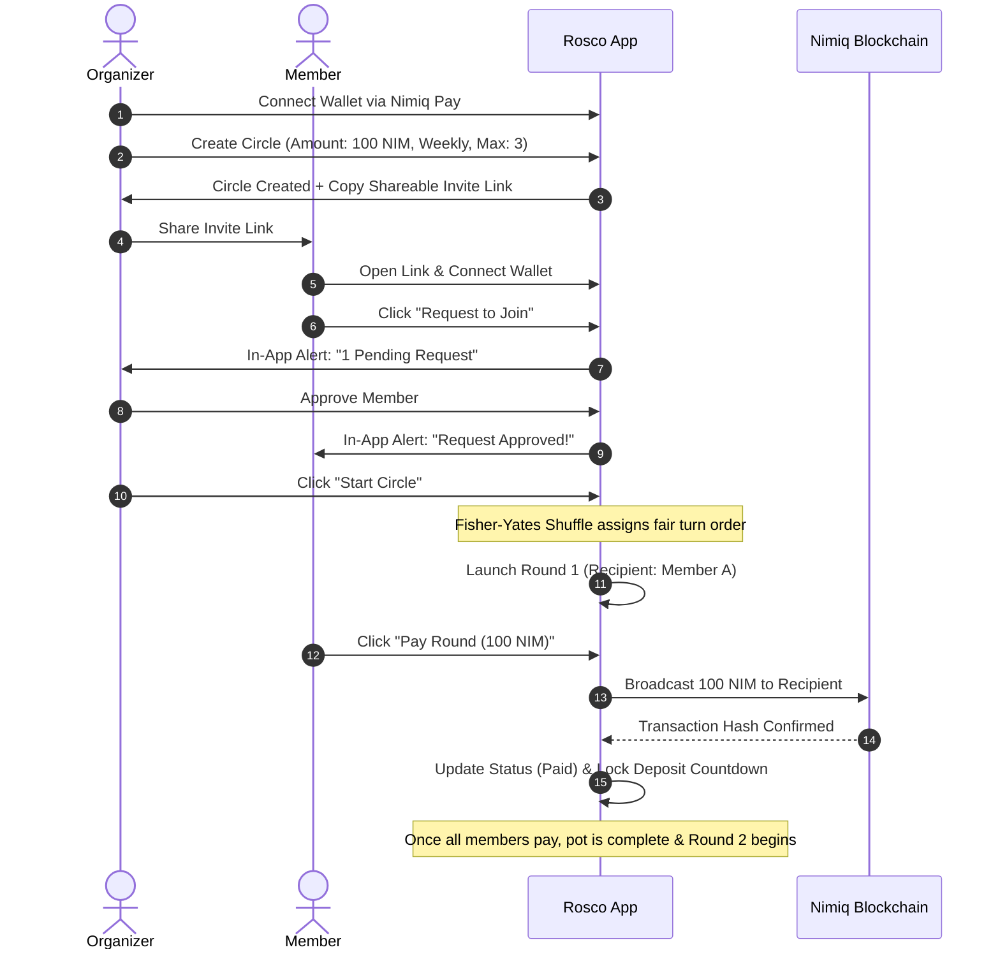
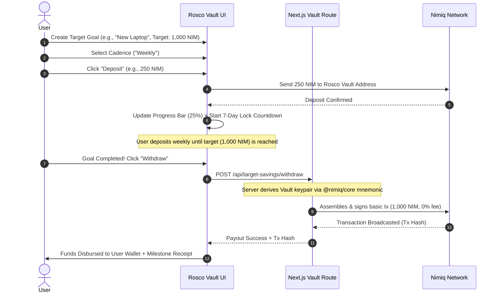

# 🌀 Rosco — Decentralized Rotating Savings & Target Vaults on Nimiq

<p align="center">
  
</p>

<p align="center">
  <strong>The modern, non-custodial Rotating Savings & Credit Association (ROSCA) and personal target vault powered by Nimiq Pay.</strong>
</p>

<p align="center">
  <a href="#-features"></a>
  <a href="#-user-flows"></a>
  <a href="#-architecture"></a>
  <a href="#-getting-started"></a>
</p>

---

## Table of Contents
- [Inspiration & Problem](#-inspiration--problem)
- [The Solution: Rosco](#-the-solution-rosco)
- [Key Features](#-key-features)
- [Detailed User Flows](#-detailed-user-flows)
  - [Flow 1: Rotating Savings Circle (ROSCA / Kolo)](#flow-1-rotating-savings-circle-rosca--kolo)
  - [Flow 2: Personal Target Savings Vault](#flow-2-personal-target-savings-vault)
- [Architecture & Tech Stack](#-architecture--tech-stack)
- [Fair Randomness Algorithm (Fisher-Yates)](#-fair-randomness-algorithm-fisher-yates)
- [Nimiq Blockchain & Vault Integration](#-nimiq-blockchain--vault-integration)
- [Environment Variables](#-environment-variables)
- [Getting Started](#-getting-started)
- [License](#-license)

---

## Inspiration & Problem

Over **1 billion people** worldwide rely on informal community rotating savings groups—known culturally as **ROSCAs**, **Esusu** (West Africa), **Kolo** (Nigeria), **Tandas** (Latin America), **Chit Funds** (India), **Hui** (East Asia), and **Pardna** (Caribbean). Together, they circulate over **$500 Billion** annually based entirely on trust.

However, traditional informal circles suffer from fatal flaws:
1. **Default & Counterparty Risk**: Members who take an early payout round can disappear or default on future payments.
2. **Manual Administration & Fraud**: Organizers must physically collect, count, track, and disburse cash, exposing groups to theft and human error.
3. **Unfair Payout Scheduling**: Turn order is often rigged or contested, creating conflict within communities.
4. **Predatory Banking Alternative**: Commercial banks charge steep account maintenance fees, enforce rigid credit checks, and provide negligible interest.

---

## The Solution: Rosco

**Rosco** re-engineers traditional community savings into a transparent, decentralized, non-custodial Web3 application powered by the **Nimiq blockchain**.

* **0% Platform Fees**: 100% of the pooled funds go directly to the rotating winner or saver.
* **Instant, Micro-Fee Settlements**: Powered by Nimiq's instant proof-of-stake Albatross consensus.
* **Native 1-Tap Nimiq Pay**: Seamless mobile checkout without exporting seed words or dealing with complex gas fees.
* **Smart Vault Discipline**: Enforced lock timers, scheduled deposits, and automatic on-chain payouts.

---

## Key Features

### 1. 🔄 Rotating Savings Circles (ROSCAs / Kolo)
* **Customizable Group Rules**: Organizers set the contribution amount (e.g. 100 NIM), member capacity (3 to 30), and payout cadence (**Daily**, **Weekly**, or **Monthly**).
* **Shareable Invite Links**: Instant onboarding via unique shareable links.
* **Organizer Approval Dashboard**: Protects groups from spam; organizers review and approve or reject join requests.
* **Fisher-Yates Fair Randomization**: Cryptographically unbiased shuffling ensures the turn order is mathematical and impossible to rig.
* **Contribution Lock & Countdown**: Prevents accidental double-deposits; contributors lock until the current round finishes and the countdown expires.
* **Real-Time Progress Tracker**: Live indicators showing `0 / N Paid` contributions per round.

### 2. 🎯 Personal Target Savings Vaults (Discipline & Solo Savings)
* **Categorized Goal Buckets**: Create isolated goals for Tech Upgrades, Emergency Funds, Rent, Travel, or Education.
* **Scheduled Cadence Enforcement**: Choose Flexible (deposit anytime) or Scheduled (Daily, Weekly, Monthly) deposit locks with live countdowns.
* **100% Automated Vault Payout**: When a goal is completed, an automated on-chain transaction signs and broadcasts from the vault mnemonic to transfer funds back to the user's Nimiq wallet.
* **Early-Exit Discipline Mechanism**:
  * **Completed Goal**: **0% Fee** (full 100% payout).
  * **Emergency Early Exit**: **10% Penalty** deducted to enforce financial discipline and deter impulsive withdrawals.

### 3. 🔔 In-App Real-Time Notification Center
* Instant alert badges for:
  * Circle creation confirmation.
  * Incoming join requests (for organizers).
  * Member approval notifications (for members).
  * Upcoming round contribution deadlines.
  * Round recipient pot payouts.
  * Target savings milestone achievements.

---

## Detailed User Flows

### Flow 1: Rotating Savings Circle (ROSCA / Kolo)



#### Step-by-Step Walkthrough:
1. **Create Circle**: Organizer defines contribution amount, cadence, and max capacity.
2. **Invite & Request**: Prospective members click the invite link and submit a join request.
3. **Review & Approve**: The organizer reviews pending applicants in their dashboard with one-click Approve/Reject actions.
4. **Fair Shuffle**: Once minimum members join, clicking **"Start Circle"** executes the Fisher-Yates shuffle to establish the transparent turn sequence.
5. **Round Contribution**: In each round, contributing members pay using Nimiq Pay. Their contribution is marked `✓ Paid`, and their deposit button locks with a countdown until the next round.
6. **Direct Pot Distribution**: The round recipient receives the entire gathered pool directly into their wallet.

---

### Flow 2: Personal Target Savings Vault



---

## Architecture & Tech Stack

```
rosco/
├── frontend/                     # Next.js 14 App Router Fullstack Web App
│   ├── src/
│   │   ├── app/
│   │   │   ├── page.tsx          # Landing page & dashboard hub
│   │   │   ├── layout.tsx        # Global layout with favicon & metadata
│   │   │   ├── globals.css       # Design system & responsive layout tokens
│   │   │   ├── create/           # Circle creation flow
│   │   │   ├── circle/[id]/      # Live rotating circle dashboard
│   │   │   └── api/              # Serverless API routes
│   │   │       ├── target-savings/withdraw/ # On-chain vault payout route
│   │   │       ├── circles/      # Circle & join request endpoints
│   │   │       └── rounds/       # Round contribution intents & confirmations
│   │   ├── components/           # Reusable UI components
│   │   │   ├── Header.tsx        # Sticky responsive navigation & wallet pill
│   │   │   ├── LandingPage.tsx   # Product landing page & pot calculator
│   │   │   ├── TargetSavingsView.tsx # Target vault UI & ledger
│   │   │   ├── RoscoLogo.tsx     # 3D rotating ribbon emblem
│   │   │   └── NotificationCenter.tsx # In-app notification drawer
│   │   └── lib/
│   │       ├── api.ts            # Client API caller with auto-fallback
│   │       ├── nimiq-pay.ts      # Nimiq Pay SDK & Hub integration
│   │       ├── notifications.ts  # In-app event notification engine
│   │       └── server-store.ts   # Persistent server-side circle store
│   └── public/                   # High-resolution logos, favicons, illustrations
└── backend/                      # Standalone Node.js/Express/Prisma backend
```

* **Frontend**: Next.js 14, React 18, TypeScript, Tailwind-free Vanilla CSS tokens.
* **Blockchain Core**: `@nimiq/core` (BIP39 Mnemonic derivation, Ed25519 key derivation, TransactionBuilder).
* **Wallet**: Nimiq Pay Hub & WebSDK.
* **Deployment**: Vercel Serverless Functions.

---

## Fair Randomness Algorithm (Fisher-Yates)

To guarantee that neither the organizer nor early joiners can rig the payout order, Rosco uses the **Fisher-Yates Shuffle Algorithm**:

```typescript
// Deterministic and unbiased permutation of all approved members
const approved = [...circle.memberships.filter(m => m.status === 'APPROVED')];

for (let i = approved.length - 1; i > 0; i--) {
  const j = Math.floor(Math.random() * (i + 1));
  [approved[i], approved[j]] = [approved[j], approved[i]];
}

// Resulting array becomes the permanent payout order for rounds 1..N
circle.payout_order = approved.map(m => m.user_id);
```

---

## Nimiq Blockchain & Vault Integration

Automatic payouts from the Target Savings Vault are executed directly on the Nimiq blockchain using `@nimiq/core`:

1. **Key Derivation**: The 24-word BIP39 mnemonic is converted to an extended private key and derived along path `m/44'/242'/0'/0'`.
2. **Network ID Support**:
   * **Testnet Albatross**: `network_id = 1` (RPC: `https://v2.nimiq-testnet.nuxt.dev`)
   * **Mainnet Albatross**: `network_id = 42` (RPC: `https://rpc.nimiqwatch.com`)
3. **Transaction Assembly**: Basic transactions are constructed with 0 Luna fee, signed with the vault's private key, and broadcasted via `sendRawTransaction`.

---

## Environment Variables

Add these to your **Vercel Project Settings ➔ Environment Variables** (or `frontend/.env.local` for local development):

```env
# 24-Word Seed Phrase for the Rosco Vault Keypair
VAULT_SEED_WORDS="your twenty four word seed words go here securely inside vercel env"

# User-Facing Deposit Address for the Vault
NEXT_PUBLIC_ROSCO_VAULT_ADDRESS="NQXX XXXX XXXX XXXX XXXX XXXX XXXX XXXX XXXX"

# Network Mode: 'testnet' or 'mainnet'
NIMIQ_NETWORK="testnet"
```

---

## Getting Started

### Prerequisites
* **Node.js** >= 18.0.0
* **pnpm** >= 8.0.0

### Installation & Run

1. **Clone the repository**:
   ```bash
   git clone https://github.com/Rampop01/Rosco.git
   cd Rosco
   ```

2. **Install dependencies**:
   ```bash
   pnpm install
   ```

3. **Configure environment**:
   ```bash
   cp frontend/.env.local.example frontend/.env.local
   # Ensure VAULT_SEED_WORDS and NEXT_PUBLIC_ROSCO_VAULT_ADDRESS are set
   ```

4. **Start local development**:
   ```bash
   pnpm dev
   ```
   Open [http://localhost:3000](http://localhost:3000) in your browser.

5. **Build for production**:
   ```bash
   pnpm --filter kolo-frontend build
   ```

---
